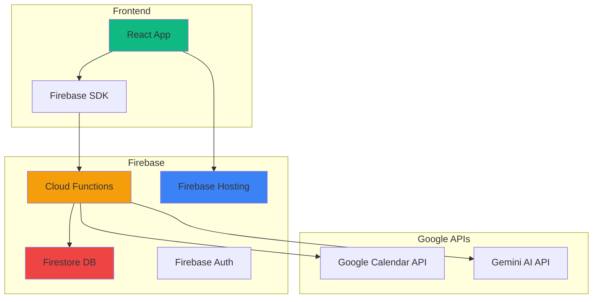

# Recanto da Natureza - Arquitetura Firebase

**Version:** 2.0 (Firebase Edition)
**Date:** 2025-12-09
**Author:** Winston (BMAD Architect)
**Stack:** React + Firebase

---

## 🎯 Decisão Arquitetural

**Escolha:** Firebase (Google-centric architecture)

**Razões:**
1. ✅ Integração natural com Google Calendar (já em uso)
2. ✅ **100% GRÁTIS** para o volume esperado
3. ✅ Mais simples que Supabase + Vercel
4. ✅ Tudo num único ecossistema Google
5. ✅ Deploy extremamente simples
6. ✅ Escalável quando necessário

---

## 📊 Arquitetura Simplificada



---

## 🏗️ Tech Stack Atualizado

### Frontend (Mantido)
- **React** 19.2.1
- **TypeScript** 5.8.2
- **Vite** 6.2.0
- **Tailwind CSS** (CDN)
- **Lucide React** (ícones)
- **date-fns** (datas)

### Backend (Novo - Firebase)
- **Firebase Functions** - Serverless backend (Node.js 20)
- **Firestore** - NoSQL database
- **Firebase Auth** - Autenticação admin
- **Firebase Hosting** - Hosting estático (substitui Vercel)
- **Firebase Admin SDK** - Server-side operations

### Integrações
- **Google Calendar API** - Gestão de reservas
- **Gemini AI** - Chatbot (via Functions)
- **Gmail API** - Emails de notificação (grátis!)

### Desenvolvimento
- **Firebase CLI** - Deploy e emuladores locais
- **Firebase Emulator Suite** - Teste local completo

---

## 📦 Dependências a Adicionar

```json
{
  "dependencies": {
    "firebase": "^10.7.1",
    "react-firebase-hooks": "^5.1.1"
  },
  "devDependencies": {
    "firebase-tools": "^13.0.0",
    "firebase-functions": "^4.5.0",
    "firebase-admin": "^12.0.0"
  }
}
```

---

## 🗄️ Estrutura de Dados - Firestore

### Collections

#### 1. **units** (Unidades de Alojamento)

```typescript
// units/{unitId}
{
  id: string,
  name: string,
  slug: string,
  description: string,
  price: number,
  capacity: number,
  bedrooms: number,
  bathrooms: number,
  amenities: string[],
  images: [
    {
      url: string,
      alt: string,
      isCover: boolean,
      order: number
    }
  ],
  googleCalendarId: string,
  isActive: boolean,
  createdAt: Timestamp,
  updatedAt: Timestamp
}
```

#### 2. **bookings** (Reservas)

```typescript
// bookings/{bookingId}
{
  id: string,
  unitId: string, // Reference to unit
  unitName: string, // Denormalized for easy queries
  guestName: string,
  guestEmail: string,
  guestPhone: string,
  checkIn: Timestamp,
  checkOut: Timestamp,
  nights: number,
  totalPrice: number,
  status: 'pending' | 'confirmed' | 'cancelled',
  googleCalendarEventId: string,
  notes: string,
  createdAt: Timestamp,
  updatedAt: Timestamp
}
```

**Indexes:**
- `unitId + checkIn` (compound index para queries de disponibilidade)
- `guestEmail` (buscar reservas por email)
- `status` (filtrar por status)

#### 3. **blockedDates** (Datas Bloqueadas)

```typescript
// blockedDates/{blockId}
{
  id: string,
  unitId: string,
  startDate: Timestamp,
  endDate: Timestamp,
  reason: string, // 'maintenance', 'owner_use', 'other'
  createdAt: Timestamp
}
```

#### 4. **chatSessions** (Histórico de Chat)

```typescript
// chatSessions/{sessionId}/messages/{messageId}
{
  sessionId: string,
  role: 'user' | 'assistant',
  content: string,
  timestamp: Timestamp,
  metadata: {
    userAgent: string,
    currentPage: string
  }
}
```

**Nota:** Subcollection para performance (messages dentro de sessions)

---

## ⚡ Firebase Functions (Backend)

### Estrutura de Pastas

```
functions/
├── src/
│   ├── index.ts                 # Entry point
│   ├── config/
│   │   └── firebase.ts          # Firebase Admin setup
│   ├── services/
│   │   ├── calendar.service.ts  # Google Calendar
│   │   ├── gemini.service.ts    # Gemini AI
│   │   ├── email.service.ts     # Gmail API
│   │   └── booking.service.ts   # Business logic
│   ├── functions/
│   │   ├── units.function.ts    # GET units
│   │   ├── booking.function.ts  # POST booking
│   │   ├── calendar.function.ts # GET availability
│   │   └── chat.function.ts     # POST chat
│   ├── validators/
│   │   └── schemas.ts           # Zod validation
│   └── types/
│       └── index.ts             # TypeScript types
├── package.json
├── tsconfig.json
└── .env.local
```

### Cloud Functions

#### 1. **getUnits** - Listar Unidades

```typescript
// GET /api/units
export const getUnits = onRequest(async (req, res) => {
  // CORS
  cors(req, res, async () => {
    try {
      const unitsSnapshot = await db.collection('units')
        .where('isActive', '==', true)
        .get();

      const units = unitsSnapshot.docs.map(doc => ({
        id: doc.id,
        ...doc.data()
      }));

      res.json({ success: true, data: units });
    } catch (error) {
      res.status(500).json({ success: false, error: error.message });
    }
  });
});
```

#### 2. **checkAvailability** - Verificar Disponibilidade

```typescript
// GET /api/calendar/:unitId/availability?start=2025-01-01&end=2025-01-31
export const checkAvailability = onRequest(async (req, res) => {
  const { unitId } = req.params;
  const { start, end } = req.query;

  try {
    // 1. Buscar eventos do Google Calendar
    const calendarEvents = await calendarService.getEvents(unitId, start, end);

    // 2. Buscar blocked dates do Firestore
    const blockedDates = await db.collection('blockedDates')
      .where('unitId', '==', unitId)
      .where('startDate', '>=', new Date(start))
      .where('endDate', '<=', new Date(end))
      .get();

    // 3. Merge e retornar
    const unavailableDates = [
      ...calendarEvents.map(e => ({ start: e.start, end: e.end, reason: 'Booked' })),
      ...blockedDates.docs.map(d => d.data())
    ];

    res.json({ success: true, data: unavailableDates });
  } catch (error) {
    res.status(500).json({ success: false, error: error.message });
  }
});
```

#### 3. **createBooking** - Criar Reserva

```typescript
// POST /api/bookings
export const createBooking = onRequest(async (req, res) => {
  try {
    // 1. Validar input com Zod
    const bookingData = bookingSchema.parse(req.body);

    // 2. Verificar disponibilidade
    const isAvailable = await bookingService.checkAvailability(
      bookingData.unitId,
      bookingData.checkIn,
      bookingData.checkOut
    );

    if (!isAvailable) {
      return res.status(400).json({
        success: false,
        error: 'Dates not available'
      });
    }

    // 3. Criar evento no Google Calendar
    const calendarEvent = await calendarService.createEvent({
      unitId: bookingData.unitId,
      summary: `Reserva: ${bookingData.guestName}`,
      description: `Email: ${bookingData.guestEmail}\nPhone: ${bookingData.guestPhone}`,
      start: bookingData.checkIn,
      end: bookingData.checkOut
    });

    // 4. Salvar no Firestore
    const bookingRef = await db.collection('bookings').add({
      ...bookingData,
      googleCalendarEventId: calendarEvent.id,
      status: 'confirmed',
      createdAt: FieldValue.serverTimestamp()
    });

    // 5. Enviar emails (assíncrono, não bloquear response)
    emailService.sendBookingConfirmation(bookingData);
    emailService.notifyOwner(bookingData);

    // 6. Retornar sucesso
    res.json({
      success: true,
      data: {
        bookingId: bookingRef.id,
        calendarEventId: calendarEvent.id
      }
    });

  } catch (error) {
    res.status(500).json({ success: false, error: error.message });
  }
});
```

#### 4. **chatWithAI** - Chat com Gemini

```typescript
// POST /api/chat
export const chatWithAI = onRequest(async (req, res) => {
  // Rate limiting (Firebase Extensions ou custom)

  try {
    const { message, sessionId } = req.body;

    // 1. Buscar contexto (units data)
    const units = await db.collection('units').get();
    const unitsContext = units.docs.map(d => d.data());

    // 2. Chamar Gemini
    const response = await geminiService.chat({
      message,
      context: unitsContext,
      sessionId
    });

    // 3. Salvar no Firestore (histórico)
    await db.collection('chatSessions').doc(sessionId)
      .collection('messages').add({
        role: 'user',
        content: message,
        timestamp: FieldValue.serverTimestamp()
      });

    await db.collection('chatSessions').doc(sessionId)
      .collection('messages').add({
        role: 'assistant',
        content: response,
        timestamp: FieldValue.serverTimestamp()
      });

    res.json({ success: true, data: { message: response } });

  } catch (error) {
    res.status(500).json({ success: false, error: error.message });
  }
});
```

---

## 🎨 Frontend Integration

### Firebase SDK Setup

```typescript
// src/lib/firebase.ts
import { initializeApp } from 'firebase/app';
import { getFunctions } from 'firebase/functions';
import { getFirestore } from 'firebase/firestore';
import { getAuth } from 'firebase/auth';

const firebaseConfig = {
  apiKey: import.meta.env.VITE_FIREBASE_API_KEY,
  authDomain: import.meta.env.VITE_FIREBASE_AUTH_DOMAIN,
  projectId: import.meta.env.VITE_FIREBASE_PROJECT_ID,
  storageBucket: import.meta.env.VITE_FIREBASE_STORAGE_BUCKET,
  messagingSenderId: import.meta.env.VITE_FIREBASE_MESSAGING_SENDER_ID,
  appId: import.meta.env.VITE_FIREBASE_APP_ID
};

const app = initializeApp(firebaseConfig);

export const functions = getFunctions(app);
export const db = getFirestore(app);
export const auth = getAuth(app);
```

### Custom Hooks

```typescript
// src/hooks/useUnits.ts
import { useEffect, useState } from 'react';
import { collection, getDocs, query, where } from 'firebase/firestore';
import { db } from '@/lib/firebase';

export function useUnits() {
  const [units, setUnits] = useState([]);
  const [loading, setLoading] = useState(true);
  const [error, setError] = useState(null);

  useEffect(() => {
    const fetchUnits = async () => {
      try {
        const q = query(
          collection(db, 'units'),
          where('isActive', '==', true)
        );
        const snapshot = await getDocs(q);
        const unitsData = snapshot.docs.map(doc => ({
          id: doc.id,
          ...doc.data()
        }));
        setUnits(unitsData);
      } catch (err) {
        setError(err);
      } finally {
        setLoading(false);
      }
    };

    fetchUnits();
  }, []);

  return { units, loading, error };
}
```

```typescript
// src/hooks/useBooking.ts
import { httpsCallable } from 'firebase/functions';
import { functions } from '@/lib/firebase';

export function useBooking() {
  const [loading, setLoading] = useState(false);
  const [error, setError] = useState(null);

  const createBooking = async (bookingData) => {
    setLoading(true);
    try {
      const createBookingFn = httpsCallable(functions, 'createBooking');
      const result = await createBookingFn(bookingData);
      return result.data;
    } catch (err) {
      setError(err);
      throw err;
    } finally {
      setLoading(false);
    }
  };

  return { createBooking, loading, error };
}
```

---

## 🚀 Plano de Implementação (Simplificado)

### **Phase 1: Firebase Setup** (1-2 dias)

**Tarefas:**
1. ✅ Criar projeto Firebase
   ```bash
   npm install -g firebase-tools
   firebase login
   firebase init
   ```

2. ✅ Configurar Firestore
   - Criar collections
   - Definir indexes
   - Importar seed data de constants.ts

3. ✅ Configurar Functions
   - Setup TypeScript
   - Instalar dependências
   - Configurar environment variables

4. ✅ Configurar Hosting
   - Link ao projeto
   - Deploy de teste

**Deliverable:** Firebase projeto pronto, Firestore populado

---

### **Phase 2: Backend Functions** (2-3 dias)

**Tarefas:**
1. ✅ Implementar `getUnits`
2. ✅ Implementar `checkAvailability` + Google Calendar API
3. ✅ Implementar `createBooking` + Calendar + Gmail
4. ✅ Implementar `chatWithAI` + Gemini
5. ✅ Testar localmente com Emulator

**Deliverable:** API funcional localmente

---

### **Phase 3: Frontend Migration** (2-3 dias)

**Tarefas:**
1. ✅ Instalar Firebase SDK
2. ✅ Criar hooks (useUnits, useBooking, useChat)
3. ✅ Refatorar App.tsx para usar hooks
4. ✅ Refatorar ChatWidget para usar chatWithAI
5. ✅ Adicionar loading states e error handling

**Deliverable:** Frontend integrado com Firebase

---

### **Phase 4: Google Calendar Integration** (2 dias)

**Tarefas:**
1. ✅ Setup Service Account no Google Cloud
2. ✅ OAuth setup
3. ✅ Testar fetch de eventos
4. ✅ Testar criação de eventos
5. ✅ Integrar no BookingCalendar component

**Deliverable:** Calendar sync funcionando

---

### **Phase 5: Polish & Deploy** (2-3 dias)

**Tarefas:**
1. ✅ Gmail API para emails
2. ✅ Google Maps integration
3. ✅ Admin panel básico (Firebase UI)
4. ✅ Testing completo
5. ✅ Deploy production
   ```bash
   firebase deploy
   ```
6. ✅ Custom domain setup

**Deliverable:** 🚀 SITE LIVE!

---

## 💰 Custos Estimados (GRÁTIS!)

### Firebase Free Tier (Spark Plan)

| Serviço | Limite Free | Suficiente Para |
|---------|-------------|-----------------|
| **Firestore** | 1GB storage, 50k reads/day | ~5k reservas, 500 visitantes/dia |
| **Functions** | 2M invocations/month | ~2000 reservas/mês |
| **Hosting** | 10GB storage, 360MB/day bandwidth | Site estático tranquilo |
| **Auth** | Unlimited | Admins ilimitados |

**Estimativa:** GRÁTIS até ~500 visitantes/dia

Se crescer, upgrade para Blaze (pay-as-you-go):
- Primeiros meses: ~€5-10/mês
- Com tráfego alto: ~€20-30/mês

---

## 🔐 Segurança

### Firebase Security Rules

**Firestore Rules:**
```javascript
rules_version = '2';
service cloud.firestore {
  match /databases/{database}/documents {

    // Units - público pode ler
    match /units/{unitId} {
      allow read: if true;
      allow write: if request.auth != null; // Só admin
    }

    // Bookings - apenas owner pode ler todas
    match /bookings/{bookingId} {
      allow read: if request.auth != null;
      allow create: if true; // Qualquer um pode criar
      allow update, delete: if request.auth != null;
    }

    // Blocked dates - só admin
    match /blockedDates/{blockId} {
      allow read: if true;
      allow write: if request.auth != null;
    }

    // Chat sessions - público pode criar e ler próprios
    match /chatSessions/{sessionId} {
      allow read, write: if true;
    }
  }
}
```

**Functions Environment Variables:**
```bash
firebase functions:config:set \
  gemini.api_key="YOUR_GEMINI_KEY" \
  google.calendar_credentials="SERVICE_ACCOUNT_JSON" \
  gmail.credentials="GMAIL_API_CREDENTIALS"
```

---

## 📱 Admin Panel (Bonus)

Firebase tem UI admin built-in!

**Opção 1: Firebase Console**
- Ver bookings em tempo real
- Editar units
- Ver analytics

**Opção 2: Custom Admin (Futuro)**
- React admin com Firebase Auth
- Dashboard com métricas
- CRUD completo

---

## 🎯 Vantagens da Arquitetura Firebase

| Aspecto | Supabase + Vercel | Firebase |
|---------|------------------|----------|
| **Custo** | €0-25/mês | €0 (muito tempo) |
| **Complexidade** | Média-Alta | Baixa |
| **Setup Time** | 1-2 semanas | 3-5 dias |
| **Deploy** | 2 serviços separados | 1 comando: `firebase deploy` |
| **Integração Google** | APIs separadas | Nativo |
| **Learning Curve** | Média | Baixa |
| **Escalabilidade** | Alta | Alta |

---

## ✅ Próximos Passos IMEDIATOS

1. **Criar projeto Firebase**
   ```bash
   firebase login
   firebase projects:create recanto-natureza
   ```

2. **Inicializar no projeto**
   ```bash
   cd "/c/Users/micao/Desktop/site marli/recanto-da-natureza---alojamento-local"
   firebase init
   ```
   - Selecionar: Firestore, Functions, Hosting
   - TypeScript: Yes
   - ESLint: Yes

3. **Instalar dependências**
   ```bash
   npm install firebase react-firebase-hooks
   cd functions && npm install
   ```

4. **Começar implementação!**

---

**PRONTO PARA COMEÇAR?** 🚀

Diga "sim" e eu executo o setup Firebase agora!
