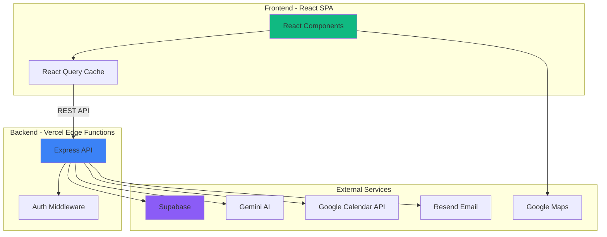

# Recanto da Natureza - Brownfield Enhancement Architecture

**Version:** 1.0
**Date:** 2025-12-09
**Author:** Winston (BMAD Architect)
**Project:** Recanto da Natureza - Alojamento Local

---

## 1. Introduction

Este documento define a arquitetura para transformar o protótipo atual do **Recanto da Natureza** em uma aplicação production-ready. O objetivo é adicionar backend seguro, persistência de dados, integrações reais e otimizações sem comprometer a excelente UI/UX já existente.

### 1.1 Enhancement Overview

**Enhancement Type:** Sistema Backend + Integrações + Segurança
**Scope:** Transformar MVP em aplicação production-ready
**Integration Impact:** Alto - Requer refatoração do frontend e adição de backend completo

### 1.2 Existing Project Analysis

#### Current Project State

- **Primary Purpose:** Website de reservas para alojamento local de luxo na natureza
- **Current Tech Stack:** React 19 + TypeScript + Vite + Tailwind CSS (CDN) + Gemini AI
- **Architecture Style:** Single Page Application (SPA) com navegação por tabs
- **Deployment Method:** Static hosting (não configurado ainda)
- **Dependencies Status:** NÃO instaladas (falta `npm install`)

#### Available Documentation

- README.md com instruções básicas de setup
- constants.ts com todos os dados estáticos
- Código bem estruturado e componentizado

#### Identified Constraints

- **Orçamento limitado** - Solução deve ser cost-effective
- **Manutenção por proprietário não-técnico** - Necessita painel admin simples
- **Integração com Google Calendar** - Já iniciada, precisa ser completada
- **Gemini API já escolhida** - Manter mas mover para backend
- **Tailwind CSS via CDN** - Manter abordagem existente
- **Sem equipe de DevOps** - Deploy deve ser simples (Vercel/Netlify)

### 1.3 Change Log

| Change | Date | Version | Description | Author |
|--------|------|---------|-------------|--------|
| Initial Architecture | 2025-12-09 | 1.0 | Arquitetura brownfield completa | Winston |

---

## 2. Enhancement Scope and Integration Strategy

### 2.1 Enhancement Overview

**Principais Melhorias:**

1. **Backend Seguro** - API Node.js/Express com autenticação
2. **Banco de Dados** - Supabase para persistência
3. **Google Calendar API Real** - Fetch e bloqueio de datas
4. **Sistema de Notificações** - Emails automáticos (Resend)
5. **Google Maps Integration** - Mapa interativo real
6. **Painel Admin** - Interface para proprietários
7. **Otimizações** - SEO, performance, analytics

### 2.2 Integration Approach

**Code Integration Strategy:**
- Frontend React existente mantido 100%
- Nova camada de API entre frontend e serviços externos
- Substituir chamadas diretas ao Gemini por chamadas à API backend
- Adicionar React Query para cache e state management de servidor

**Database Integration:**
- Supabase como backend-as-a-service
- Migrar dados de constants.ts para banco de dados
- Manter constants.ts como seed data
- Admin panel para editar conteúdo

**API Integration:**
- Backend Node.js hospedado como Vercel Edge Functions
- RESTful API com endpoints para: bookings, units, AI chat, calendar
- CORS configurado para permitir frontend

**UI Integration:**
- Componentes existentes mantidos
- Adicionar loading states e error boundaries
- Melhorar feedback visual para operações assíncronas
- Adicionar toast notifications

### 2.3 Compatibility Requirements

- **Existing API Compatibility:** N/A (não há API existente)
- **Database Schema Compatibility:** N/A (não há DB existente)
- **UI/UX Consistency:** CRITICAL - manter 100% da experiência atual
- **Performance Impact:** Melhorar carregamento com lazy loading e caching

---

## 3. Tech Stack

### 3.1 Existing Technology Stack

| Category | Current Technology | Version | Usage in Enhancement | Notes |
|----------|-------------------|---------|---------------------|-------|
| Frontend Framework | React | 19.2.1 | Mantido | Última versão |
| Language | TypeScript | 5.8.2 | Mantido | Type safety |
| Build Tool | Vite | 6.2.0 | Mantido | Dev server e build |
| Styling | Tailwind CSS (CDN) | 3.x | Mantido | Design system atual |
| Icons | Lucide React | 0.555.0 | Mantido | Biblioteca de ícones |
| Date Utils | date-fns | 4.1.0 | Mantido | Manipulação de datas |
| AI SDK | @google/genai | 1.31.0 | Movido para backend | Segurança |

### 3.2 New Technology Additions

| Technology | Version | Purpose | Rationale | Integration Method |
|-----------|---------|---------|-----------|-------------------|
| **Supabase** | Latest | Backend-as-a-Service | DB + Auth + Storage integrado | SDK no frontend e backend |
| **Node.js** | 20 LTS | Backend runtime | Serverless functions | Vercel Edge Functions |
| **Express.js** | 4.18+ | API framework | Simplicidade e maturidade | Backend API |
| **React Query** | 5.x | Server state management | Cache e sincronização | Frontend |
| **Zod** | 3.x | Validation | Type-safe validation | Frontend e backend |
| **Resend** | Latest | Email service | Simplicidade e cost-effective | Backend API |
| **Google Calendar API** | v3 | Calendar integration | Requisito do cliente | Backend API |
| **Google Maps API** | Latest | Mapa interativo | Requisito de negócio | Frontend |
| **Posthog** | Latest | Analytics | Privacy-focused analytics | Frontend |

---

## 4. Data Models and Schema Changes

### 4.1 New Data Models

#### 4.1.1 Unit (Accommodation)

**Purpose:** Armazenar informações das unidades de alojamento
**Integration:** Migrar de constants.ts para DB com interface de admin

```typescript
interface Unit {
  id: string // UUID
  name: string
  slug: string // URL-friendly
  description: string
  price: number // Em euros
  capacity: number
  bedrooms: number
  bathrooms: number
  amenities: string[] // Array de amenidades
  images: Image[]
  googleCalendarId: string
  isActive: boolean
  createdAt: Date
  updatedAt: Date
}

interface Image {
  id: string
  unitId: string
  url: string
  alt: string
  order: number
  isCover: boolean
}
```

#### 4.1.2 Booking

**Purpose:** Armazenar reservas dos hóspedes
**Integration:** Nova entidade para gerenciar bookings

```typescript
interface Booking {
  id: string // UUID
  unitId: string // FK to Unit
  guestName: string
  guestEmail: string
  guestPhone: string
  checkIn: Date
  checkOut: Date
  nights: number
  totalPrice: number
  status: BookingStatus // pending, confirmed, cancelled
  googleCalendarEventId: string
  paymentStatus: PaymentStatus // pending, paid, refunded
  notes: string
  createdAt: Date
  updatedAt: Date
}

enum BookingStatus {
  PENDING = 'pending',
  CONFIRMED = 'confirmed',
  CANCELLED = 'cancelled',
  COMPLETED = 'completed'
}

enum PaymentStatus {
  PENDING = 'pending',
  PAID = 'paid',
  REFUNDED = 'refunded'
}
```

#### 4.1.3 BlockedDate

**Purpose:** Datas bloqueadas por manutenção ou outros motivos
**Integration:** Nova entidade para controle de disponibilidade

```typescript
interface BlockedDate {
  id: string
  unitId: string // FK to Unit
  startDate: Date
  endDate: Date
  reason: string
  createdAt: Date
}
```

#### 4.1.4 Admin User

**Purpose:** Usuários administradores do sistema
**Integration:** Supabase Auth + custom profile

```typescript
interface AdminUser {
  id: string // Supabase Auth ID
  email: string
  name: string
  role: AdminRole
  createdAt: Date
  lastLogin: Date
}

enum AdminRole {
  OWNER = 'owner',
  MANAGER = 'manager'
}
```

#### 4.1.5 ChatMessage

**Purpose:** Log de conversas com o chatbot
**Integration:** Nova entidade para histórico e análise

```typescript
interface ChatMessage {
  id: string
  sessionId: string
  role: 'user' | 'assistant'
  content: string
  metadata: object // Dados contextuais
  createdAt: Date
}
```

### 4.2 Schema Integration Strategy

**Database:** Supabase PostgreSQL

**New Tables:**
- units
- unit_images
- bookings
- blocked_dates
- admin_users (extends Supabase auth.users)
- chat_messages

**Migration Strategy:**
1. Criar schema inicial via Supabase migration
2. Seed data de constants.ts para tabela units
3. Configurar Row Level Security (RLS) policies
4. Setup triggers para updated_at automático

**Backward Compatibility:**
- constants.ts mantido como fallback durante desenvolvimento
- Frontend gradualmente migrado para buscar de API

---

## 5. Component Architecture

### 5.1 System Architecture Overview



### 5.2 New Components

#### 5.2.1 Backend API Service

**Responsibility:** Camada de API segura entre frontend e serviços externos

**Key Interfaces:**
- `/api/units` - CRUD de unidades
- `/api/bookings` - Gestão de reservas
- `/api/chat` - Proxy para Gemini AI
- `/api/calendar/:unitId` - Disponibilidade via Google Calendar
- `/api/admin/*` - Endpoints administrativos

**Dependencies:**
- Supabase para DB
- Gemini AI para chat
- Google Calendar API para disponibilidade
- Resend para emails

**Technology Stack:** Node.js 20 + Express.js + TypeScript

**File Structure:**
```
api/
├── index.ts              # Express app setup
├── middleware/
│   ├── auth.ts          # JWT validation
│   ├── error.ts         # Error handling
│   └── cors.ts          # CORS config
├── routes/
│   ├── units.ts         # GET /api/units
│   ├── bookings.ts      # POST /api/bookings
│   ├── chat.ts          # POST /api/chat
│   ├── calendar.ts      # GET /api/calendar/:id
│   └── admin.ts         # Admin endpoints
├── services/
│   ├── gemini.ts        # Gemini integration
│   ├── calendar.ts      # Google Calendar
│   ├── email.ts         # Resend integration
│   └── supabase.ts      # DB client
├── validators/
│   └── schemas.ts       # Zod schemas
└── types.ts             # TypeScript types
```

#### 5.2.2 Supabase Client (Frontend)

**Responsibility:** Client-side connection to Supabase

**Key Interfaces:**
- Authentication
- Real-time subscriptions (opcional para admin panel)

**Technology:** @supabase/supabase-js

#### 5.2.3 React Query Integration

**Responsibility:** Server state management e caching

**Key Hooks:**
- `useUnits()` - Fetch e cache unidades
- `useAvailability(unitId)` - Disponibilidade por unidade
- `useBooking()` - Mutation para criar reserva
- `useChat()` - Chat com AI (optimistic updates)

**Technology:** @tanstack/react-query

#### 5.2.4 Admin Panel Components

**Responsibility:** Interface administrativa para proprietários

**New Components:**
- `AdminLayout` - Layout com sidebar
- `AdminUnits` - CRUD de unidades
- `AdminBookings` - Lista e gestão de reservas
- `AdminCalendar` - Visualização de disponibilidade
- `AdminSettings` - Configurações gerais

**Technology:** Mesma stack do frontend atual

---

## 6. API Design

### 6.1 API Integration Strategy

**API Integration Strategy:** RESTful API com autenticação JWT
**Authentication:** Supabase Auth para admin, API keys para frontend público
**Versioning:** /api/v1/* (preparado para futuras versões)

### 6.2 API Endpoints

#### 6.2.1 GET /api/units

**Purpose:** Buscar lista de unidades ativas
**Auth:** Público
**Integration:** Substitui constants.UNITS

**Response:**
```json
{
  "success": true,
  "data": [
    {
      "id": "uuid",
      "name": "Casa da Serra",
      "slug": "casa-da-serra",
      "description": "...",
      "price": 120,
      "capacity": 4,
      "bedrooms": 2,
      "bathrooms": 2,
      "amenities": ["Wi-Fi", "Cozinha", "..."],
      "images": [
        {
          "url": "https://...",
          "alt": "Casa da Serra vista frontal",
          "isCover": true
        }
      ],
      "googleCalendarId": "..."
    }
  ]
}
```

#### 6.2.2 GET /api/calendar/:unitId/availability

**Purpose:** Buscar datas disponíveis de uma unidade
**Auth:** Público
**Integration:** Google Calendar API + BookedDates table

**Query Params:**
- `startDate` (ISO date)
- `endDate` (ISO date)

**Response:**
```json
{
  "success": true,
  "data": {
    "unitId": "uuid",
    "blockedDates": [
      {
        "start": "2025-12-15",
        "end": "2025-12-20",
        "reason": "Booked"
      },
      {
        "start": "2025-12-25",
        "end": "2025-12-26",
        "reason": "Maintenance"
      }
    ]
  }
}
```

#### 6.2.3 POST /api/bookings

**Purpose:** Criar nova reserva
**Auth:** Público (rate limited)
**Integration:** Supabase + Google Calendar + Resend

**Request:**
```json
{
  "unitId": "uuid",
  "guestName": "João Silva",
  "guestEmail": "joao@example.com",
  "guestPhone": "+351 123 456 789",
  "checkIn": "2025-12-15",
  "checkOut": "2025-12-20",
  "notes": "Chegada às 15h"
}
```

**Response:**
```json
{
  "success": true,
  "data": {
    "bookingId": "uuid",
    "confirmationCode": "RN2025001",
    "totalPrice": 600,
    "nights": 5,
    "status": "pending",
    "googleCalendarEventId": "gcal_event_id"
  }
}
```

**Side Effects:**
1. Criar evento no Google Calendar
2. Enviar email de confirmação ao hóspede
3. Enviar notificação ao proprietário

#### 6.2.4 POST /api/chat

**Purpose:** Proxy seguro para Gemini AI
**Auth:** Público (rate limited)
**Integration:** Gemini AI com contexto do site

**Request:**
```json
{
  "message": "Quais são as unidades disponíveis?",
  "sessionId": "session_uuid",
  "context": {
    "currentPage": "home"
  }
}
```

**Response:**
```json
{
  "success": true,
  "data": {
    "message": "Temos 3 unidades disponíveis: Casa da Serra...",
    "sessionId": "session_uuid"
  }
}
```

#### 6.2.5 POST /api/admin/login

**Purpose:** Login administrativo
**Auth:** Supabase Auth
**Integration:** Supabase Auth

**Request:**
```json
{
  "email": "admin@recanto.com",
  "password": "secure_password"
}
```

**Response:**
```json
{
  "success": true,
  "data": {
    "accessToken": "jwt_token",
    "refreshToken": "refresh_token",
    "user": {
      "id": "uuid",
      "email": "admin@recanto.com",
      "role": "owner"
    }
  }
}
```

---

## 7. External API Integration

### 7.1 Google Calendar API

- **Purpose:** Buscar eventos de reserva e criar novos
- **Documentation:** https://developers.google.com/calendar
- **Authentication:** OAuth 2.0 (Service Account)
- **Integration Method:** Backend API com google-auth-library

**Key Endpoints Used:**
- `GET /calendars/{calendarId}/events` - Listar eventos
- `POST /calendars/{calendarId}/events` - Criar evento
- `PATCH /calendars/{calendarId}/events/{eventId}` - Atualizar evento

**Error Handling:** Retry com exponential backoff, fallback para DB

### 7.2 Google Gemini AI

- **Purpose:** Chatbot inteligente sobre o alojamento
- **Documentation:** https://ai.google.dev/
- **Authentication:** API Key (server-side)
- **Integration Method:** @google/genai SDK no backend

**System Instruction:**
```
Você é Flora, assistente virtual do Recanto da Natureza.
Responda perguntas sobre as unidades, serviços, atividades e localização.
Dados: [contexto dinâmico do banco de dados]
```

**Error Handling:** Mensagem genérica ao usuário, log detalhado

### 7.3 Resend Email API

- **Purpose:** Envio de emails transacionais
- **Documentation:** https://resend.com/docs
- **Authentication:** API Key
- **Integration Method:** resend SDK

**Email Templates:**
1. **Confirmação de Reserva** - Para hóspede
2. **Nova Reserva** - Para proprietário
3. **Cancelamento** - Para ambos
4. **Lembrete Check-in** - 24h antes

**Error Handling:** Queue com retry, notificação ao admin se falhar

### 7.4 Google Maps JavaScript API

- **Purpose:** Mapa interativo na página Location
- **Documentation:** https://developers.google.com/maps
- **Authentication:** API Key (frontend com restrições)
- **Integration Method:** @googlemaps/js-api-loader

**Features:**
- Marker na localização do Recanto
- Direções do ponto atual
- Pontos de interesse próximos

---

## 8. Source Tree

### 8.1 Existing Project Structure

```
recanto-da-natureza---alojamento-local/
├── .bmad-core/           # BMAD workflow (não deployado)
├── components/           # React components
│   ├── BookingCalendar.tsx
│   ├── ChatWidget.tsx
│   └── UnitCard.tsx
├── App.tsx               # Main app
├── constants.ts          # Static data
├── types.ts              # TypeScript types
├── index.tsx             # React entry
├── index.html            # HTML entry
├── package.json
├── tsconfig.json
├── vite.config.ts
└── README.md
```

### 8.2 New File Organization

```
recanto-da-natureza---alojamento-local/
├── .bmad-core/                   # Existente
├── api/                          # NEW - Backend API
│   ├── index.ts
│   ├── middleware/
│   ├── routes/
│   ├── services/
│   ├── validators/
│   └── types.ts
├── components/                   # Existente + novos
│   ├── BookingCalendar.tsx      # Existente
│   ├── ChatWidget.tsx           # Existente (refatorado)
│   ├── UnitCard.tsx             # Existente
│   ├── admin/                   # NEW - Admin components
│   │   ├── AdminLayout.tsx
│   │   ├── AdminSidebar.tsx
│   │   ├── AdminUnits.tsx
│   │   ├── AdminBookings.tsx
│   │   └── AdminCalendar.tsx
│   ├── ui/                      # NEW - UI primitives
│   │   ├── Button.tsx
│   │   ├── Input.tsx
│   │   ├── Modal.tsx
│   │   ├── Toast.tsx
│   │   └── Spinner.tsx
│   └── GoogleMap.tsx            # NEW - Map component
├── hooks/                       # NEW - Custom hooks
│   ├── useUnits.ts
│   ├── useBooking.ts
│   ├── useAvailability.ts
│   ├── useChat.ts
│   └── useAuth.ts
├── lib/                         # NEW - Utilities
│   ├── supabase.ts              # Supabase client
│   ├── queryClient.ts           # React Query config
│   ├── utils.ts                 # Helper functions
│   └── constants.ts             # Moved from root
├── pages/                       # NEW - Page components
│   ├── Home.tsx
│   ├── Admin.tsx
│   └── AdminLogin.tsx
├── docs/                        # NEW - Documentation
│   ├── architecture.md          # Este documento
│   └── api.md                   # API reference
├── supabase/                    # NEW - Supabase config
│   ├── migrations/
│   │   └── 001_initial_schema.sql
│   └── seed.sql
├── App.tsx                      # Existente (refatorado)
├── constants.ts                 # DEPRECATED (mover para lib/)
├── types.ts                     # Existente (estendido)
├── index.tsx                    # Existente (add QueryClientProvider)
├── index.html                   # Existente
├── .env.local                   # Existente (+ novas vars)
├── .env.example                 # NEW - Template de env vars
├── package.json                 # Atualizado
├── tsconfig.json                # Existente
├── vercel.json                  # NEW - Vercel config
├── vite.config.ts               # Existente
└── README.md                    # Atualizado
```

### 8.3 Integration Guidelines

**File Naming:**
- Components: PascalCase (AdminLayout.tsx)
- Hooks: camelCase com prefixo use (useUnits.ts)
- Utils: camelCase (queryClient.ts)
- Types: PascalCase ou shared types.ts

**Folder Organization:**
- `/components` - Componentes React reutilizáveis
- `/pages` - Componentes de página (rotas principais)
- `/hooks` - Custom hooks
- `/lib` - Utilities, clients, configurações
- `/api` - Backend code

**Import/Export Patterns:**
- Usar path alias `@/` para imports absolutos
- Named exports para múltiplos exports
- Default export para componentes principais

---

## 9. Infrastructure and Deployment

### 9.1 Existing Infrastructure

**Current Deployment:** Nenhum (projeto local)
**Infrastructure Tools:** Nenhum
**Environments:** Apenas desenvolvimento local

### 9.2 Enhancement Deployment Strategy

**Hosting Provider:** Vercel (Frontend + Backend)

**Deployment Approach:**
1. **Frontend:** Vite build → Vercel Static Hosting
2. **Backend:** API routes como Vercel Serverless Functions
3. **Database:** Supabase (managed PostgreSQL)
4. **File Storage:** Supabase Storage (futuro - para upload de imagens)

**Architecture Diagram:**

```
[User Browser]
     ↓
[Vercel CDN] ← Vite build (static assets)
     ↓
[Vercel Functions] ← API routes (/api/*)
     ↓
[Supabase] ← PostgreSQL + Auth + Storage
     ↓
[External APIs] ← Gemini, Google Calendar, Resend
```

**Infrastructure Changes:**
- Criar conta Vercel
- Criar projeto Supabase
- Configurar custom domain
- Setup DNS

**Pipeline Integration:**
- Git push → Vercel auto-deploy
- Preview deployments para branches
- Environment variables via Vercel dashboard

**Environment Variables:**
```bash
# Frontend (.env.local)
VITE_SUPABASE_URL=https://xxx.supabase.co
VITE_SUPABASE_ANON_KEY=xxx
VITE_GOOGLE_MAPS_API_KEY=xxx
VITE_API_BASE_URL=https://recanto.vercel.app/api

# Backend (Vercel Environment)
DATABASE_URL=postgresql://...
SUPABASE_SERVICE_KEY=xxx
GEMINI_API_KEY=xxx
GOOGLE_CALENDAR_CREDENTIALS=xxx (JSON)
RESEND_API_KEY=xxx
JWT_SECRET=xxx
```

### 9.3 Rollback Strategy

**Rollback Method:**
1. Vercel permite rollback instant para deploy anterior
2. Database migrations com down() scripts
3. Feature flags para desabilitar funcionalidades

**Risk Mitigation:**
- Staging environment para testes
- Gradual rollout (canary deployment)
- Health checks em todos os endpoints

**Monitoring:**
- Vercel Analytics para performance
- Supabase Dashboard para DB metrics
- Posthog para user analytics
- Sentry para error tracking (futuro)

---

## 10. Coding Standards

### 10.1 Existing Standards Compliance

**Code Style:**
- TypeScript strict mode
- Functional components com hooks
- Clean code, nomes descritivos

**Linting Rules:**
- ESLint com config do Vite
- TypeScript compiler com strict: true

**Testing Patterns:**
- Nenhum teste existente (será adicionado)

**Documentation Style:**
- Comentários inline mínimos
- README com setup instructions

### 10.2 Enhancement-Specific Standards

**API Error Handling:**
- Sempre retornar JSON com { success, data?, error? }
- Status codes corretos (200, 201, 400, 401, 404, 500)
- Mensagens de erro user-friendly

**TypeScript:**
- Evitar `any`, usar `unknown` se necessário
- Interfaces para shapes, types para unions/intersections
- Zod schemas para runtime validation

**React Best Practices:**
- Hooks no top level
- useCallback para funções passadas como props
- useMemo para cálculos pesados
- Avoid prop drilling com Context onde apropriado

**Database:**
- Sempre usar prepared statements (SQL injection prevention)
- Transactions para operações multi-table
- Indexes em foreign keys e campos de busca

### 10.3 Critical Integration Rules

**Existing API Compatibility:** N/A (sem API existente)

**Database Integration:**
- Todas queries via Supabase client
- Row Level Security (RLS) sempre ativo
- Never trust client input

**Error Handling:**
- Try-catch em todas async operations
- Logging de erros com contexto
- User-friendly messages, technical details em logs

**Logging Consistency:**
- Estrutura: `[timestamp] [level] [service] message`
- Níveis: debug, info, warn, error
- Nunca logar secrets ou PII

---

## 11. Testing Strategy

### 11.1 Integration with Existing Tests

**Existing Test Framework:** Nenhum
**Test Organization:** Será criado
**Coverage Requirements:** Mínimo 70% para código crítico

### 11.2 New Testing Requirements

#### 11.2.1 Unit Tests

**Framework:** Vitest (compatível com Vite)
**Location:** `__tests__` folders next to source
**Coverage Target:** 70% para utils e services
**Integration with Existing:** Nova estrutura

**Priority Areas:**
- API validators (Zod schemas)
- Service functions (email, calendar)
- React hooks custom
- Utility functions

#### 11.2.2 Integration Tests

**Scope:** API endpoints e2e
**Tool:** Supertest + Vitest
**Existing System Verification:** N/A
**New Feature Testing:**
- Criar booking → verifica DB + Calendar + Email
- Chat com AI → verifica rate limiting
- Admin auth → verifica JWT

#### 11.2.3 E2E Tests

**Scope:** User flows críticos
**Tool:** Playwright
**Scenarios:**
1. User faz reserva completa
2. Admin faz login e visualiza bookings
3. Chatbot responde corretamente

#### 11.2.4 Regression Testing

**Existing Feature Verification:**
- UI/UX existente não pode quebrar
- Visual regression com Playwright screenshots

**Automated Regression Suite:**
- CI/CD pipeline com Vercel
- Testes rodam em cada PR

**Manual Testing Requirements:**
- QA checklist antes de deploy para produção
- Teste em mobile devices reais

---

## 12. Security Integration

### 12.1 Existing Security Measures

**Authentication:** Nenhuma (site público)
**Authorization:** Nenhuma
**Data Protection:** HTTPS via hosting provider
**Security Tools:** Nenhum

### 12.2 Enhancement Security Requirements

**New Security Measures:**

1. **API Key Protection**
   - Gemini API key NUNCA exposta ao cliente
   - Google Calendar credentials em backend
   - Environment variables nunca commitadas

2. **Rate Limiting**
   - Booking API: 5 requests/minute por IP
   - Chat API: 10 requests/minute por session
   - Admin API: 100 requests/minute por user

3. **Input Validation**
   - Zod schemas em todos endpoints
   - SQL injection prevention via Supabase client
   - XSS prevention com React (escape automático)

4. **Authentication & Authorization**
   - Supabase Auth para admin
   - JWT tokens com expiry
   - Refresh token rotation

5. **CORS**
   - Whitelist de domínios permitidos
   - Credentials: true apenas para domínio próprio

6. **Content Security Policy (CSP)**
   - Headers via Vercel config
   - Permitir apenas recursos de domínios confiáveis

**Integration Points:**
- Middleware de autenticação em rotas admin
- Validators em todos POST/PUT endpoints
- Rate limiters em rotas públicas

**Compliance Requirements:**
- GDPR compliance (Portugal)
- Cookie consent (futuro)
- Privacy policy e terms (futuro)

### 12.3 Security Testing

**Existing Security Tests:** Nenhum

**New Security Test Requirements:**
- API rate limiting tests
- Authentication bypass tests
- SQL injection attempts (automated)
- XSS payload tests

**Penetration Testing:**
- Manual pentest antes do launch
- OWASP Top 10 checklist

---

## 13. Performance Optimization

### 13.1 Current Performance Issues

1. **Tailwind via CDN** - ~2MB download
2. **Sem image optimization** - Imagens grandes do Unsplash
3. **Sem lazy loading** - Tudo carrega de uma vez
4. **Sem caching** - Dados sempre refetched

### 13.2 Optimization Strategy

**Frontend:**
- Migrar Tailwind para build-time (npm package)
- Image optimization via Vercel Image Optimization
- Lazy loading de imagens e componentes
- React Query cache por 5 minutos
- Code splitting por rota

**Backend:**
- Cache de units list (Redis futuro, por agora in-memory)
- Debounce de calendar API calls
- Batch requests onde possível

**Database:**
- Indexes em campos de busca
- Connection pooling via Supabase
- Apenas fetch campos necessários

**Target Metrics:**
- Lighthouse Score > 90
- First Contentful Paint < 1.5s
- Time to Interactive < 3.5s
- Largest Contentful Paint < 2.5s

---

## 14. SEO & Analytics

### 14.1 SEO Improvements

**Meta Tags:**
- Título e descrição únicos por "página" (tab)
- Open Graph tags para social sharing
- Twitter Card tags
- Canonical URL

**Structured Data:**
- Schema.org/LocalBusiness
- Schema.org/LodgingBusiness
- Reviews schema (futuro)

**Technical SEO:**
- Sitemap.xml
- Robots.txt
- Alt text em todas imagens
- Semantic HTML

**Content Strategy:**
- Blog section (futuro)
- FAQ section
- Local SEO keywords

### 14.2 Analytics

**Posthog:**
- Page views
- Booking funnel tracking
- Chat interactions
- Button clicks
- Form submissions

**Dashboards:**
- Admin dashboard com métricas-chave
- Conversion rate
- Popular units
- Booking lead time

---

## 15. Next Steps - Implementation Plan

### 15.1 Phase 1: Foundation (Week 1-2)

**Priority: CRITICAL**

1. ✅ Setup Infrastructure
   - [ ] Criar conta Vercel
   - [ ] Criar projeto Supabase
   - [ ] Configurar environment variables
   - [ ] npm install no projeto

2. ✅ Database Setup
   - [ ] Criar schema inicial (migrations)
   - [ ] Seed data de constants.ts
   - [ ] Setup Row Level Security policies
   - [ ] Testar conexão frontend ↔ Supabase

3. ✅ Backend API - Core
   - [ ] Setup Express + TypeScript
   - [ ] Criar estrutura de pastas /api
   - [ ] Implementar GET /api/units
   - [ ] Deploy test no Vercel

4. ✅ Frontend Integration
   - [ ] Instalar React Query
   - [ ] Criar useUnits() hook
   - [ ] Refatorar App.tsx para usar API
   - [ ] Testar end-to-end

**Deliverables:**
- Database funcional com dados
- API básica deployada
- Frontend conectado à API

**Success Criteria:**
- Site carrega unidades do DB via API
- Sem API key exposta no frontend

---

### 15.2 Phase 2: Booking System (Week 3-4)

**Priority: HIGH**

1. ✅ Google Calendar Integration
   - [ ] Setup Service Account
   - [ ] Implementar calendar.ts service
   - [ ] Criar GET /api/calendar/:id/availability
   - [ ] Integrar no BookingCalendar component

2. ✅ Booking Creation
   - [ ] Implementar POST /api/bookings
   - [ ] Criar evento no Google Calendar
   - [ ] Salvar no DB
   - [ ] Validação de datas disponíveis

3. ✅ Email Notifications
   - [ ] Setup Resend
   - [ ] Template de confirmação
   - [ ] Template de notificação para admin
   - [ ] Integrar em POST /api/bookings

4. ✅ Frontend Booking Flow
   - [ ] Adicionar form de guest info
   - [ ] Loading states
   - [ ] Success/error feedback
   - [ ] Confirmation screen

**Deliverables:**
- Sistema de reservas funcional
- Emails automáticos
- Calendar sync bidirecional

**Success Criteria:**
- User consegue fazer reserva completa
- Datas são bloqueadas no calendário
- Emails são enviados

---

### 15.3 Phase 3: AI Chat & Maps (Week 5)

**Priority: MEDIUM**

1. ✅ AI Chat Backend
   - [ ] Mover Gemini para backend
   - [ ] Implementar POST /api/chat
   - [ ] Rate limiting
   - [ ] Context dinâmico do DB

2. ✅ Chat Frontend
   - [ ] Refatorar ChatWidget para usar API
   - [ ] Loading states
   - [ ] Error handling

3. ✅ Google Maps
   - [ ] Setup Maps API
   - [ ] Criar GoogleMap component
   - [ ] Integrar na Location tab
   - [ ] Adicionar markers e directions

**Deliverables:**
- Chat seguro e funcional
- Mapa interativo

**Success Criteria:**
- Gemini API key não exposta
- Mapa funciona em mobile

---

### 15.4 Phase 4: Admin Panel (Week 6-7)

**Priority: MEDIUM**

1. ✅ Authentication
   - [ ] Setup Supabase Auth
   - [ ] Login page
   - [ ] Protected routes
   - [ ] JWT middleware

2. ✅ Admin UI
   - [ ] AdminLayout component
   - [ ] Dashboard com métricas
   - [ ] Units CRUD
   - [ ] Bookings list

3. ✅ Admin Features
   - [ ] Block dates manually
   - [ ] Edit unit details
   - [ ] View booking history
   - [ ] Export bookings (CSV)

**Deliverables:**
- Painel admin funcional
- Proprietário consegue gerenciar conteúdo

**Success Criteria:**
- Login seguro
- CRUD completo de units
- Bookings visíveis

---

### 15.5 Phase 5: Optimization & Launch (Week 8)

**Priority: HIGH**

1. ✅ Performance
   - [ ] Migrar Tailwind para npm
   - [ ] Image optimization
   - [ ] Lazy loading
   - [ ] Lighthouse audit (>90 score)

2. ✅ SEO
   - [ ] Meta tags
   - [ ] Structured data
   - [ ] Sitemap
   - [ ] Social sharing

3. ✅ Testing
   - [ ] Unit tests críticos
   - [ ] E2E tests principais flows
   - [ ] Manual QA checklist
   - [ ] Cross-browser testing

4. ✅ Security
   - [ ] Security headers
   - [ ] Rate limiting final
   - [ ] OWASP checklist
   - [ ] Pentest básico

5. ✅ Documentation
   - [ ] README atualizado
   - [ ] API documentation
   - [ ] Admin user guide
   - [ ] Deployment guide

6. ✅ Launch
   - [ ] Custom domain setup
   - [ ] SSL certificate
   - [ ] Analytics setup
   - [ ] Monitoring setup
   - [ ] 🚀 GO LIVE

**Deliverables:**
- Site otimizado e seguro
- Documentação completa
- Produção ready

**Success Criteria:**
- Lighthouse >90
- Todos testes passando
- Zero critical security issues

---

## 16. Handoff Instructions

### 16.1 Para o Developer (DEV Agent)

Olá Dev! Este documento define toda a arquitetura do Recanto da Natureza. Aqui está o que você precisa saber:

**Contexto:**
- Projeto React/TypeScript existente com UI excelente
- Precisa de backend, segurança e integrações
- Seguir Implementation Plan (Section 15)

**Primeiro Passo:**
1. Executar `npm install` no projeto
2. Criar conta Supabase e Vercel
3. Configurar .env.local com as chaves
4. Começar por Phase 1: Foundation

**Arquivos Críticos:**
- Esta arquitetura (docs/architecture.md)
- constants.ts (migrar para DB)
- App.tsx (refatorar para usar APIs)

**Princípios:**
- Manter UI/UX 100% igual
- Segurança first (nunca expor secrets)
- Código limpo e testado

**Dúvidas:**
- Verificar seções específicas deste doc
- Consultar templates em .bmad-core/templates
- Pedir ajuda ao Architect se necessário

---

### 16.2 Para o QA Agent

Olá QA! Seu papel é garantir qualidade em cada fase:

**Testing Checklist:**

**Phase 1 - Foundation:**
- [ ] Site carrega sem erros
- [ ] Unidades aparecem corretamente
- [ ] Nenhuma API key visível no network tab

**Phase 2 - Booking:**
- [ ] User consegue selecionar datas
- [ ] Form validation funciona
- [ ] Email chega corretamente
- [ ] Evento criado no Google Calendar
- [ ] Datas ficam bloqueadas

**Phase 3 - AI & Maps:**
- [ ] Chat responde corretamente
- [ ] Rate limiting funciona
- [ ] Mapa carrega em todas telas
- [ ] Directions funcionam

**Phase 4 - Admin:**
- [ ] Login seguro
- [ ] Apenas admin acessa
- [ ] CRUD de units funciona
- [ ] Booking list correta

**Phase 5 - Launch:**
- [ ] Lighthouse score >90
- [ ] Funciona em mobile
- [ ] Cross-browser (Chrome, Safari, Firefox)
- [ ] Security headers corretos
- [ ] OWASP Top 10 checklist

**Reportar:**
- Bugs no formato: [Severity] [Component] Description
- Sugestões de melhoria
- Performance issues

---

## 17. Risk Assessment

### 17.1 Technical Risks

| Risk | Probability | Impact | Mitigation |
|------|------------|--------|------------|
| Google Calendar API quota exceeded | Medium | High | Caching, rate limiting, fallback to DB |
| Gemini API instável | Low | Medium | Timeout, fallback message, retry logic |
| Database migration failure | Low | Critical | Backup antes, rollback script, staging test |
| Vercel cold starts | Medium | Low | Keep-alive pings, accept trade-off |
| Cost overrun (APIs) | Medium | Medium | Quotas, monitoring, alerts |

### 17.2 Business Risks

| Risk | Probability | Impact | Mitigation |
|------|------------|--------|------------|
| User confusion com mudanças | Low | Medium | Manter UI igual, soft launch |
| Double bookings durante migração | Low | Critical | Disable bookings durante deploy, testing rigoroso |
| Proprietário não adota admin panel | Medium | Low | Treinamento, UX simples |
| Competição com Booking.com | High | Medium | Focus em experiência única, chat AI |

---

## 18. Success Metrics

### 18.1 Technical Metrics

- **Uptime:** >99.5%
- **Lighthouse Score:** >90
- **API Response Time:** <500ms (p95)
- **Error Rate:** <1%
- **Test Coverage:** >70%

### 18.2 Business Metrics

- **Booking Conversion Rate:** >5%
- **Chat Engagement:** >30%
- **Mobile Traffic:** >60%
- **Bounce Rate:** <40%
- **Average Session Duration:** >3min

---

## 19. Glossary

- **Brownfield:** Projeto existente sendo melhorado (oposto de greenfield)
- **RLS:** Row Level Security (Supabase)
- **JWT:** JSON Web Token (autenticação)
- **CDN:** Content Delivery Network
- **Edge Functions:** Serverless functions executadas perto do user
- **OWASP:** Open Web Application Security Project
- **LCP:** Largest Contentful Paint (métrica de performance)
- **GDPR:** General Data Protection Regulation (EU)

---

## 20. Appendix

### 20.1 Useful Links

- Supabase Docs: https://supabase.com/docs
- Vercel Docs: https://vercel.com/docs
- React Query Docs: https://tanstack.com/query
- Gemini AI Docs: https://ai.google.dev
- Google Calendar API: https://developers.google.com/calendar
- Resend Docs: https://resend.com/docs

### 20.2 Contact

- **Architect:** Winston (BMAD)
- **Project Owner:** Micao
- **Project Name:** Recanto da Natureza

---

**END OF ARCHITECTURE DOCUMENT**

*Version 1.0 | 2025-12-09 | Created with BMAD™ Core*
