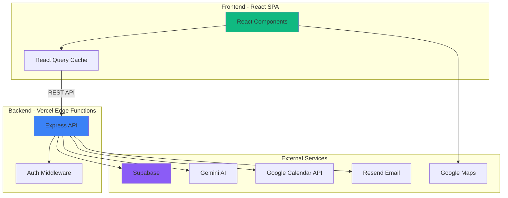

# 5. Component Architecture

### 5.1 System Architecture Overview



### 5.2 New Components

#### 5.2.1 Backend API Service

**Responsibility:** Camada de API segura entre frontend e serviços externos

**Key Interfaces:**
- `/api/units` - CRUD de unidades
- `/api/bookings` - Gestão de reservas
- `/api/chat` - Proxy para Gemini AI
- `/api/calendar/:unitId` - Disponibilidade via Google Calendar
- `/api/admin/*` - Endpoints administrativos

**Dependencies:**
- Supabase para DB
- Gemini AI para chat
- Google Calendar API para disponibilidade
- Resend para emails

**Technology Stack:** Node.js 20 + Express.js + TypeScript

**File Structure:**
```
api/
├── index.ts              # Express app setup
├── middleware/
│   ├── auth.ts          # JWT validation
│   ├── error.ts         # Error handling
│   └── cors.ts          # CORS config
├── routes/
│   ├── units.ts         # GET /api/units
│   ├── bookings.ts      # POST /api/bookings
│   ├── chat.ts          # POST /api/chat
│   ├── calendar.ts      # GET /api/calendar/:id
│   └── admin.ts         # Admin endpoints
├── services/
│   ├── gemini.ts        # Gemini integration
│   ├── calendar.ts      # Google Calendar
│   ├── email.ts         # Resend integration
│   └── supabase.ts      # DB client
├── validators/
│   └── schemas.ts       # Zod schemas
└── types.ts             # TypeScript types
```

#### 5.2.2 Supabase Client (Frontend)

**Responsibility:** Client-side connection to Supabase

**Key Interfaces:**
- Authentication
- Real-time subscriptions (opcional para admin panel)

**Technology:** @supabase/supabase-js

#### 5.2.3 React Query Integration

**Responsibility:** Server state management e caching

**Key Hooks:**
- `useUnits()` - Fetch e cache unidades
- `useAvailability(unitId)` - Disponibilidade por unidade
- `useBooking()` - Mutation para criar reserva
- `useChat()` - Chat com AI (optimistic updates)

**Technology:** @tanstack/react-query

#### 5.2.4 Admin Panel Components

**Responsibility:** Interface administrativa para proprietários

**New Components:**
- `AdminLayout` - Layout com sidebar
- `AdminUnits` - CRUD de unidades
- `AdminBookings` - Lista e gestão de reservas
- `AdminCalendar` - Visualização de disponibilidade
- `AdminSettings` - Configurações gerais

**Technology:** Mesma stack do frontend atual

---

